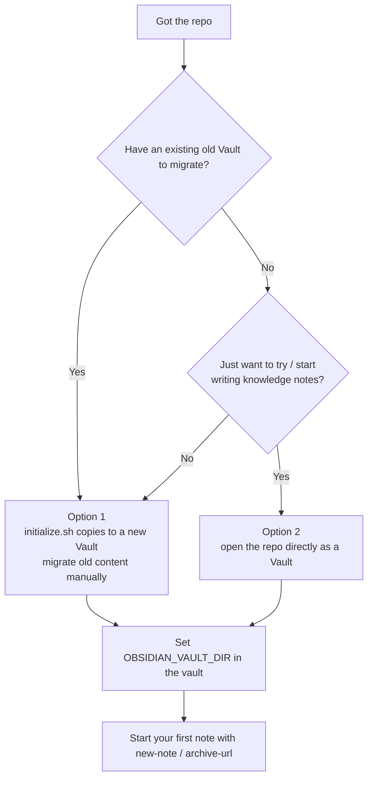
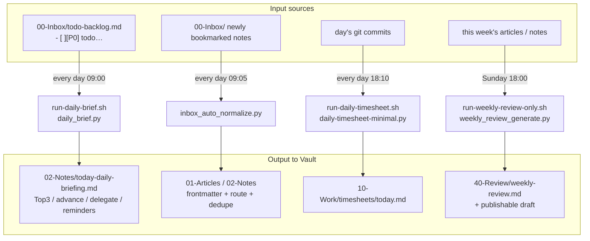
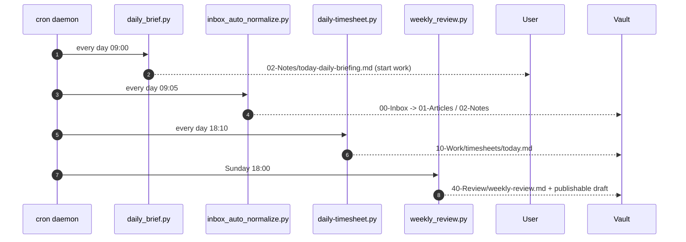
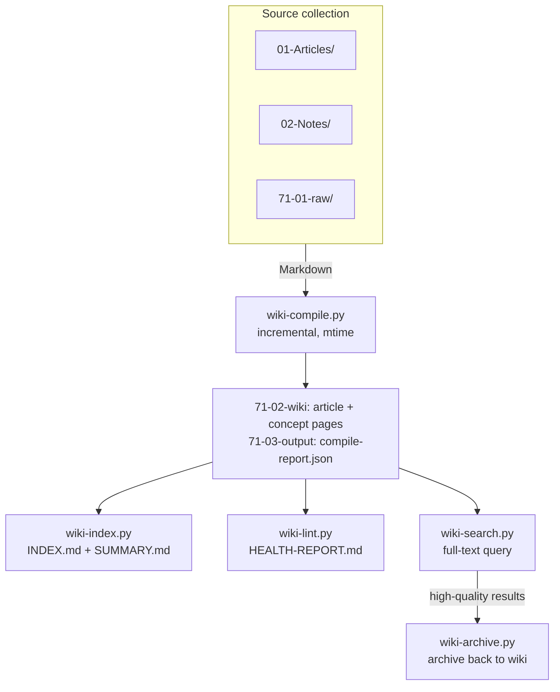

<p align="center">
  
  
  
  
</p>

<h1 align="center">Obsidian AI Vault Scaffold</h1>

<p align="center">A reusable <b>AI knowledge-base Vault scaffold</b> for Obsidian: standard partitioned directories, frontmatter conventions, day-to-day scripts, and scheduled automations.</p>
<p align="center"><a href="./README.zh-CN.md">中文</a></p>
<p align="center">The repo itself is a complete Vault skeleton you can open directly in Obsidian · scripts work out of the box · zero hard-coded personal paths</p>

<hr>

## Table of Contents

- [What is it](#-what-is-it)
- [Why](#-why)
- [Core Concepts](#-core-concepts)
- [Structure](#-structure)
- [Quick Start](#-quick-start)
- [Script Cheat Sheet](#-script-cheat-sheet)
- [Daily Playbook](#-daily-playbook-real-world-examples)
- [Scheduled Tasks](#-scheduled-tasks)
- [LLM Wiki (Knowledge Compilation)](#-llm-wiki-knowledge-compilation)
- [Related Projects](#-related-projects)
- [Design Principles](#-design-principles)
- [FAQ](#-faq)
- [Roadmap](#-roadmap)
- [Contributing](#-contributing)
- [License](#-license)
- [Maintainer](#-maintainer)

## 🎯 What is it

Distilled from a real personal Obsidian + LLM knowledge-base workspace. It turns "partitioning → conventions → scripts → automation → scheduling" into a reusable template:

- **Standard partitioned directories**: `00-Inbox / 01-Articles / 02-Notes / 03-Projects / 04-Memory / 10-Work / 30-Tasks / 40-Review / 60-Life / 70-System / 71-Wiki / 80-Resources / 90-Archive / 91-Bases / 99-Attachments`, each with a clear responsibility.
- **Frontmatter conventions**: every note carries uniform metadata — searchable, clusterable, and good for knowledge graphs.
- **Day-to-day scripts** (Python 3.11+, mostly standard library):
  - `new-note.py` — one-command new note with conventional frontmatter + skeleton (auto tags).
  - `add-frontmatter.py` — backfill metadata for legacy `.md` files without frontmatter.
  - `html-to-md.py` — web page / HTML → Markdown.
  - `archive-url.sh` / `openclaw-dropin.sh` — bookmark a link / generate a note.
  - `qmd-noise-guard.sh` — scan for noise files at the index root.
- **Scheduled automations** (`70-System/70.04-Tools/automations/`): daily briefing, automatic Inbox normalization, daily timesheets, weekly review, P0/P1 → reminders.
- **Scheduling templates** (cron / launchd): see `70-System/70.05-Configs/templates/`.
- **LLM Wiki subsystem placeholder**: the `71-Wiki` directory contract is complete; the compile scripts are delegated to the separate `llm-wiki-knowledge-vault` repo (avoids duplicate maintenance).

## 🤔 Why

| Pain point | Alternative downsides | This scaffold |
| --- | --- | --- |
| Obsidian notes grow messy with no unified convention | Manual filing, relies on habit, quickly loses control as content grows | 15 clearly scoped partitions + frontmatter conventions from the start, machine-queryable |
| Re-creating notes / backfilling metadata / tracking timesheets every day | Scattered template scripts, not parameterized | A set of standard-library-first scripts, parameterized via `OBSIDIAN_VAULT_DIR`, zero hard-coding |
| Want the daily pipeline to run fully automatically | Hand-written crons, no logs, no idempotency | Ready cron/launchd templates + structured logs + non-destructive automation |
| Need to compile an LLM knowledge base into a Wiki | Compilation logic duplicated, two sources of truth | `71-Wiki` is a thin-interface placeholder delegating to `llm-wiki-knowledge-vault`, single responsibility |

**Summary**: bundle the "capture → normalize → automate daily" loop into an out-of-the-box Vault template. Clone and use.

## 🧠 Core Concepts

- **Partition numbering**: two-digit space-prefixed prefixes keep ordering (00 temp → 99 attachments); `70-System` uses `70.XX-category` sub-layers where larger numbers lean toward docs/conventions (70.03 scripts → 70.07 docs). `71-Wiki` is independently numbered (71.01 raw → 71.04 scripts), parallel to 70, so the knowledge product is managed separately.
- **Repo is a Vault**: clone and open directly; scripts live in their conventional runtime locations; `OBSIDIAN_VAULT_DIR` injects all paths and falls back to the current working directory when unset.
- **Non-destructive automation**: scanners only report, never auto-delete/move; `add-frontmatter` only adds and never overwrites; `inbox_auto_normalize` uses `state.json` for idempotency.

## 🗂 Structure

```text
.
├── AGENTS.example.md            # Workspace rules template → copy to AGENTS.md to enable (LLM behavior boundaries, persistence rules, Python conventions)
├── initialize.sh                # One-command init: copy this repo into a fresh standalone Vault (dry-run safe)
├── LICENSE                      # MIT open-source license
├── NOTICE.md                    # Copyright / attribution notice
├── README.md                    # This file: English overview
├── README.zh-CN.md              # Chinese overview
│
├── 00-Inbox/                    # 📥 Temporary capture: links, screenshots, drafts (awaiting triage)
├── 01-Articles/                 # 📄 Formal articles/readable docs (primary script output; knowledge source ①)
│   #   inner subdirs by type: Knowledge/ Learning/ Article/ (new-note auto-classifies)
├── 02-Notes/                    # 📝 Main formal notes (briefings/reviews/study notes; knowledge source ②)
├── 03-Projects/                 # 💻 Code/scripts/project assets (executables + per-project README)
├── 04-Memory/                   # 🧠 Formal long-term memory (topic memory, preferences, project state)
├── 10-Work/                     # 🏢 Work material
│   └── timesheets/              #   Daily timesheet records (daily-timesheet script output)
├── 30-Tasks/                    # ✅ Plans and todos (daily/weekly plans, task lists, tech plans)
├── 40-Review/                   # 🔄 Reviews and retrospectives (weekly/monthly/yearly/project)
│   #   optional period subdirs: 40.01-Weekly/ 40.02-Monthly/ …
├── 60-Life/                     # 🌿 Life material (travel, interests, …)
│
├── 70-System/                   # ⚙️ System layer (scripts, automations, configs, conventions — the core asset)
│   ├── 70.03-Scripts/
│   │   └── scripts/             # Day-to-day scripts (Python/shell, standard library first)
│   │       ├── new-note.py           # One-command note with conventional frontmatter (auto tag/route)
│   │       ├── add-frontmatter.py    # Backfill frontmatter for legacy md (safe, no overwrite)
│   │       ├── html-to-md.py         # Web page/HTML → Markdown
│   │       ├── archive-url.sh        # Bookmark a link as a knowledge note (calls openclaw-dropin)
│   │       ├── openclaw-dropin.sh    # Generic "content → note" entry (title/body/tag)
│   │       └── qmd-noise-guard.sh    # Scan for noise files at index root (non-destructive report)
│   │
│   ├── 70.04-Tools/
│   │   └── automations/         # Scheduled automations (cron/launchd targets)
│   │       ├── daily_brief.py             # Daily briefing: P0-P3 backlog → Top3/advance/delegate
│   │       ├── inbox_auto_normalize.py    # Normalize & route Inbox files to formal areas (state.json dedupe)
│   │       ├── daily-timesheet-minimal.py # Daily timesheet → 10-Work/timesheets
│   │       ├── weekly_review_generate.py  # Weekly review: summarize the week / generate per config
│   │       ├── brain_to_reminders.py      # P0/P1 todos → reminders (push/notification)
│   │       ├── run-daily-brief.sh         # Daily briefing wrapper (env injection + logging)
│   │       ├── run-daily-timesheet.sh     # Daily timesheet wrapper
│   │       ├── run-weekly-review-only.sh  # Weekly-review-only wrapper
│   │       └── weekly_review_config.json  # Weekly review config (period/dirs/template)
│   │
│   ├── 70.05-Configs/
│   │   └── templates/           # Config templates (initialize.sh copies + writes real values)
│   │       ├── vault.env.example    # Env var template (OBSIDIAN_VAULT_DIR / LOG_DIR …)
│   │       ├── cron.template        # crontab schedule list (incl. AUTODIR variable)
│   │       └── launchd.example.plist # macOS daemon config sample (launchctl)
│   │
│   ├── 70.06-Workflows/
│   │   └── automation-runtime/   # Automation runtime (auto-created, usually .gitignore)
│   │       ├── state.json       #   inbox_auto_normalize dedupe state
│   │       └── logs/            #   per-task run logs (cron-*.log / run-*.json)
│   │
│   └── 70.07-Docs/
│       └── rules/               # Conventions (LLM agents must read; landed as knowledge-base rules)
│           ├── frontmatter-spec.md   # required frontmatter fields, category/tags guidance, auto-tag policy
│           └── document-routing.md   # content routing rules (which partition to use)
│
├── 71-Wiki/                     # 📚 LLM knowledge compilation workbench (placeholder; delegates to llm-wiki-knowledge-vault)
│   ├── README.md                #   integration notes
│   ├── 71-01-raw/               #   Wiki-only raw material (clippings/RSS/imports)
│   ├── 71-02-wiki/              #   compiled output (article + concept pages; read-only, script-generated)
│   ├── 71-03-output/            #   runtime state, compile reports, cron logs
│   └── 71-04-scripts/           #   core scripts (compile/index/lint/search)
│
├── 80-Resources/                # 🧰 Resources and templates
├── 90-Archive/                  # 🗄 Historical archive (inactive but kept)
├── 91-Bases/                    # 🗃 Databases / base data (structured query sources)
├── 99-Attachments/              # 📎 Attachments (PDF/images/binary)
│
└── docs/                        # Human-readable docs for this repo
    ├── README.md                #   docs index
    └── guides/
        ├── getting-started.md   #   init + quick start
        └── timers.md            #   cron / launchd scheduling integration
```

**Partition numbering convention**: two-digit space-prefixed prefixes keep ordering (00 temp → 99 attachments); `70-System` uses `70.XX-category` sub-layers where larger numbers lean toward docs/conventions (70.03 scripts → 70.07 docs). `71-Wiki` is independently numbered (71.01 raw → 71.04 scripts), parallel to 70, so the knowledge product is managed separately.

## 🚀 Quick Start

Requirements: `bash 3.2+`, `python3` (3.11+, on macOS use `/opt/homebrew/bin/python3.13` — **not** the system `/Library/Frameworks/Python` framework build).

### Option 1: initialize into a fresh standalone Vault

```bash
git clone https://github.com/<you>/obsidian-ai-vault-scaffold.git
cd obsidian-ai-vault-scaffold
./initialize.sh /path/to/your-new-vault
```

### Option 2: use this repo directly as a Vault

Open this repo in Obsidian, then:

```bash
export OBSIDIAN_VAULT_DIR=/abs/path/to/this/vault
python3 70-System/70.03-Scripts/scripts/new-note.py --kind learning --title "My first note"
```

> All scripts read the vault root from the `OBSIDIAN_VAULT_DIR` env var; when unset they fall back to the current working directory. **No hard-coded personal paths.**

**Which option on first use?**



## ⚡ Script Cheat Sheet

```bash
# New knowledge/learning/article/project note (auto frontmatter + skeleton + tags)
OBSIDIAN_VAULT_DIR=$PWD python3 70-System/70.03-Scripts/scripts/new-note.py \
  --kind learning --title "Python asyncio" --tags "AI,Python" --source "https://..."

# Backfill frontmatter for legacy md (safe: only adds, never overwrites)
python3 70-System/70.03-Scripts/scripts/add-frontmatter.py <root_dir> [--dry-run]

# Bookmark a URL as a knowledge note
70-System/70.03-Scripts/scripts/archive-url.sh "https://example.com/article"

# Daily briefing / weekly review (automation)
OBSIDIAN_VAULT_DIR=$PWD 70-System/70.04-Tools/automations/run-daily-brief.sh
OBSIDIAN_VAULT_DIR=$PWD 70-System/70.04-Tools/automations/run-weekly-review-only.sh
```

See each script's docstring and [docs/guides/](docs/guides/) for details.

## 📖 Daily Playbook (real-world examples)

The examples below follow a **personal daily knowledge workflow**, organized as one complete loop: capture → settle → briefing → review. All commands assume `OBSIDIAN_VAULT_DIR` is exported (`export OBSIDIAN_VAULT_DIR=/path/to/vault`).

### Scenario 1: Save a web page into the knowledge base (quick capture → formal area)

This is the most frequent action — see a great article/page and turn it into a conventional note in one click:

```bash
# Step 1: bookmark the URL; auto frontmatter + skeleton + tags
OBSIDIAN_VAULT_DIR=$PWD 70-System/70.03-Scripts/scripts/archive-url.sh \
  "https://blog.example.com/python-asyncio-best-practices"
# output -> 00-Inbox/YYYY-MM-DD-title.md (staged, awaiting the daily Inbox scrub)

# To file it immediately, use new-note with a type and tags:
OBSIDIAN_VAULT_DIR=$PWD python3 70-System/70.03-Scripts/scripts/new-note.py \
  --kind article --title "Python asyncio best practices" \
  --tags "Python,Concurrency,Engineering" --source "https://blog.example.com/python-asyncio-best-practices"
# output -> 01-Articles/Article/YYYY-MM-DD-Python-asyncio-best-practices.md
```

**Design intent**: `00-Inbox` is the only "drop anything" place; every other partition requires conventional naming + frontmatter. `inbox_auto_normalize` scrubs, routes, and dedupes the Inbox daily (`state.json` guarantees idempotency).

### Scenario 2: manually create a study / work note

```bash
# Study note (auto-routed to 01-Articles/Learning; default tags include Learning/Notes)
python3 70-System/70.03-Scripts/scripts/new-note.py --kind learning --title "RAG in a nutshell" --tags "LLM,RAG" --source "internal training"

# Meeting minutes (goes under 10-Work subdirs)
python3 70-System/70.03-Scripts/scripts/new-note.py --kind project --title "Membership-VIP-phase2-PMO" --category "PMO"
```

### Scenario 3: clean up legacy "dirty" files (no frontmatter / messy naming)

Over time a knowledge base accumulates stray bare `.md` files. Batch backfill frontmatter (**safe: only adds, never overwrites**):

```bash
# Preview what would change (dry-run does not write)
python3 70-System/70.03-Scripts/scripts/add-frontmatter.py 00-Inbox --dry-run

# Then actually apply
python3 70-System/70.03-Scripts/scripts/add-frontmatter.py 00-Inbox
```

Scan for noise files (non-destructive report only, no deletion):

```bash
70-System/70.03-Scripts/scripts/qmd-noise-guard.sh
```

### Scenario 4: the daily loop (feel the full automation output manually)



```bash
# Manually run the "daily briefing": read P0–P3 from 00-Inbox/todo-backlog.md, produce today's action list
OBSIDIAN_VAULT_DIR=$PWD 70-System/70.04-Tools/automations/run-daily-brief.sh
# output -> 02-Notes/YYYY-MM-DD-daily-briefing.md (Top3 / advance / awaiting feedback / delegate / remind)

# Manually scrub the Inbox once
OBSIDIAN_VAULT_DIR=$PWD python3 70-System/70.04-Tools/automations/inbox_auto_normalize.py

# Manually log a timesheet (works without git)
OBSIDIAN_VAULT_DIR=$PWD python3 70-System/70.04-Tools/automations/daily-timesheet-minimal.py --date YYYY-MM-DD
# output -> 10-Work/timesheets/timesheet-YYYY-MM-DD.md

# Run the weekly review of this week's output
OBSIDIAN_VAULT_DIR=$PWD 70-System/70.04-Tools/automations/run-weekly-review-only.sh
# output -> 40-Review/40.01-Weekly/YYYY-MM-DD-weekly-review.md (+ publishable draft to 01-Articles)
```

**How to feed the briefing**: write todos line-by-line in `00-Inbox/todo-backlog.md`, marking priority with `[P0]`/`[P1]`/`[P2]`/`[P3]` (one `- [ ] [P0] must-do-today` line per task). `daily_brief.py` reads it and plans "Top3 / advance / delegate" by priority.

### Scenario 5: convert an HTML page to Markdown, then file it

```bash
# Web page -> Markdown (for second-pass editing; not directly into the Vault)
python3 70-System/70.03-Scripts/scripts/html-to-md.py \
  --url "https://example.com/long-article" -o /tmp/article.md
# Then new-note can cite /tmp/article.md as the body, or file it under 71-Wiki/71-01-raw
```

### The daily rhythm (make it muscle memory)

```text
09:00 morning  Daily briefing (cron) → open 02-Notes/today-daily-briefing.md
any time      good article/link → archive-url / new-note into 00-Inbox
09:05 morning  Inbox normalization (cron) → routed into formal areas
18:10 evening  Timesheet (cron) → generates a timesheet
Sunday 18:00  Weekly review (cron) → this week's output + next week's actions
```

Visual timeline (renders in Mermaid-capable environments):



## ⏰ Scheduled Tasks

Attach the automation scripts to the system scheduler and they run fully automatically. Ready templates:
- `70-System/70.05-Configs/templates/cron.template` (full schedule, with variables)
- `70-System/70.05-Configs/templates/launchd.example.plist` (macOS daemon)
- Setup steps and launchd details: **[docs/guides/timers.md](docs/guides/timers.md)**

### Full cron example (with comments)

Replace `<VAULT>` below with your vault's absolute path and paste into `crontab -e`. This schedule matches the "daily rhythm" above:

```cron
SHELL=/bin/zsh
PATH=/usr/bin:/bin:/usr/sbin:/sbin:/opt/homebrew/bin
PYTHON=${OBSIDIAN_PYTHON:-/opt/homebrew/bin/python3.13}
VAULT=/path/to/your/vault
AUTODIR=${VAULT}/70-System/70.04-Tools/automations
LOGDIR=${VAULT}/70-System/70.06-Workflows/automation-runtime/logs
WIKIDIR=${VAULT}/71-Wiki
WIKILOGDIR=${VAULT}/71-Wiki/71-03-output

# ── Daily tasks ──────────────────────────────
# 09:00  daily briefing: read P0-P3 from todo-backlog -> today's action list in 02-Notes
0 9 * * * OBSIDIAN_VAULT_DIR="$VAULT" /bin/zsh "$AUTODIR/run-daily-brief.sh" >> "$LOGDIR/cron-daily-brief.log" 2>&1

# 09:05  Inbox normalization: backfill frontmatter, merge/route, dedupe (state.json idempotent)
5 9 * * * OBSIDIAN_VAULT_DIR="$VAULT" "$PYTHON" "$AUTODIR/inbox_auto_normalize.py" >> "$LOGDIR/cron-inbox-normalize.log" 2>&1

# 09:10  push P0/P1 todos to Apple Reminders (optional; depends on remindctl)
10 9 * * * OBSIDIAN_VAULT_DIR="$VAULT" "$PYTHON" "$AUTODIR/brain_to_reminders.py" >> "$LOGDIR/cron-brain-to-reminders.log" 2>&1

# 18:10  timesheet: generate a timesheet into 10-Work/timesheets from today's git commits (optional)
10 18 * * * OBSIDIAN_VAULT_DIR="$VAULT" /bin/zsh "$AUTODIR/run-daily-timesheet.sh" >> "$LOGDIR/cron-daily-timesheet.log" 2>&1

# 09:15 / 18:15  LLM Wiki incremental compilation (optional; integrate llm-wiki-knowledge-vault first)
15 9,18 * * * cd "$WIKIDIR" && "$PYTHON" 71-04-scripts/wiki-compile.py >> "$WIKILOGDIR/cron.log" 2>&1

# ── Weekly tasks ──────────────────────────────
# Mon 09:20  LLM Wiki health/index consistency check (optional)
20 9 * * 1 cd "$WIKIDIR" && "$PYTHON" 71-04-scripts/wiki-lint.py >> "$WIKILOGDIR/cron-lint.log" 2>&1

# Sunday 18:00  weekly review: summarize the week's article output + next-week actions
0 18 * * 0 OBSIDIAN_VAULT_DIR="$VAULT" /bin/zsh "$AUTODIR/run-weekly-review-only.sh" >> "$LOGDIR/cron-weekly-review.log" 2>&1
```

### Reading logs & troubleshooting

```bash
# Three core logs
tail -f 70-System/70.06-Workflows/automation-runtime/logs/cron-daily-brief.log
tail -f 70-System/70.06-Workflows/automation-runtime/logs/cron-inbox-normalize.log
tail -f 70-System/70.06-Workflows/automation-runtime/logs/cron-weekly-review.log

# A task not firing? 
#  1) Run the script once manually in the terminal and read stderr (scripts are idempotent)
#  2) Ensure OBSIDIAN_VAULT_DIR is exported (cron passes it explicitly; run manually yourself)
#  3) Ensure PYTHON points to python3 (≥3.11); on macOS avoid the broken /Library/Frameworks build
#  4) launchd: write OBSIDIAN_VAULT_DIR into StandardOut/StandardErr or EnvironmentVariables
```

## 📚 LLM Wiki (Knowledge Compilation)

`71-Wiki/` is the **LLM knowledge subsystem** inside the Vault: it incrementally compiles Markdown sources scattered across articles/notes/raw material into linked, searchable, lintable Wiki output. It is the "heaviest" capability here, but **deliberately kept as a thin interface** — see the design rationale below.

### What actually ships in this repo's 71-Wiki

Let's clarify the boundary so you don't mistake `71-Wiki/` for an empty shell:

```text
71-Wiki/
├── README.md        # directory contract + integration notes (a real file)
├── 71-01-raw/       # Wiki-only raw material: clippings / RSS / imports (has .gitkeep)
├── 71-02-wiki/      # compiled output: article + concept pages (has .gitkeep, read-only)
├── 71-03-output/    # runtime state + compile reports + cron logs (has .gitkeep)
└── 71-04-scripts/   # compile/index/lint/search/archive scripts (has .gitkeep, placeholder)
```

This repo ships: the **directory contract** (the five-part layout above) + a **README integration guide**. No compile scripts are bundled — this is intentional (see "Why").

### How it runs (full pipeline)

The subsystem is a **one-way pipeline**; each step is an independent script that can run manually or be chained by cron:



Readable as ASCII (terminal-friendly):

```text
source collection                 incremental compile          index         lint          search
01-Articles ─┐                                              │              │              │
02-Notes   ──┤ → wiki-compile → article+concept pages → wiki-index → wiki-lint → wiki-search → wiki-archive
71-01-raw  ──┘   (writes 71-02-wiki)        (INDEX/SUMMARY)   (HEALTH-REPORT)  (full-text)  (archive gems)
```

1. **`wiki-compile.py`** (compile)
   - Collects Markdown from three source dirs: `01-Articles/`, `02-Notes/`, `71-01-raw/` — aligned with this repo's routing conventions (articles/notes/raw).
   - **Incremental mode (default)**: tracks each source file's `mtime` in `71-03-output/`; skips already-compiled unchanged files; only compiles new/changed ones.
   - Renders two outputs into `71-02-wiki/`: **article pages** (normalized body + concept links) and **concept pages** (aggregate by concept, interlinked, auto-merging multiple sources of the same concept).
   - Writes a `compile-report.json` to `71-03-output/` each run (what was compiled, how many skipped).
   - `--full` forces a full recompile: clears the output dir first, avoiding stale concept/article pages that cause broken links and noise.
2. **`wiki-index.py`** (indexing): regenerates `71-02-wiki/INDEX.md` (all articles + one-line summaries) and `SUMMARY.md` (topic-level overview). Usually runs right after compile.
3. **`wiki-lint.py`** (health): checks broken links, dependencies, missing summaries, etc., producing `71-02-wiki/HEALTH-REPORT.md`. Non-destructive, report only.
4. **`wiki-search.py`** (search): plain full-text search over the compiled wiki, `wiki-search.py "<keyword>" [--top N] [--json]`.
5. **`wiki-archive.py`** (archive): archives high-quality Q&A/exploration results back into the wiki, closing the loop.

### Division of labor with the compile subsystem (Karpathy design criteria)

This split follows three engineering principles, avoiding the common "stuffed scaffold" trap:

- **Single responsibility, no duplicate maintenance**: the Wiki's compile/render/search has its own test, release, and version cadence; if this repo also shipped a `wiki-compile.py`, the two would drift into two sources of truth. The scaffold owns only the **directory contract + day-to-day scripts + automations**; the compile implementation lives in `llm-wiki-knowledge-vault`.
- **Minimal change, surgical integration**: integration does one thing — drop `llm-wiki-knowledge-vault`'s `71-04-scripts/` into this repo's `71-Wiki/71-04-scripts/`; everything else in the layout stays. The contract is that directory layout: stable and verifiable.
- **Verifiable success criteria (not "just make it run")**: every pipeline step produces a checkable artifact — `compile-report.json` (how much compiled), `INDEX.md/SUMMARY.md` (is the index complete), `HEALTH-REPORT.md` (any broken links). Cron logs live in `71-03-output/cron*.log`, so a problem is locatable in one glance.
- **Non-destructive**: the compile-output area `71-02-wiki/` is read-only, script-generated, and manual edits get overwritten; lint only reports, never deletes — continuing the scaffold's "scanners only report" automation principle.

### Integration & scheduling

Copy the sister repo `llm-wiki-knowledge-vault`'s scripts in, then add two cron lines (full cron above in "Scheduled Tasks"):

```cron
# every day 09:15 / 18:15 compile + index
15 9,18 * * * cd "$WIKIDIR" && "$PYTHON" 71-04-scripts/wiki-compile.py && "$PYTHON" 71-04-scripts/wiki-index.py >> 71-03-output/cron.log 2>&1

# Mon 09:20 health check
20 9 * * 1 cd "$WIKIDIR" && "$PYTHON" 71-04-scripts/wiki-lint.py >> 71-03-output/cron-lint.log 2>&1
```

> Note: the `"$WIKIDIR"` etc. variable definitions come from the full example in the "Scheduled Tasks" section above.

## 🔗 Related Projects

| Repo | Role |
| --- | --- |
| **obsidian-ai-vault-scaffold** | This repo: Vault scaffold (directories + conventions + scripts + automation + scheduling) |
| **llm-wiki-knowledge-vault** | LLM knowledge compilation subsystem (incl. public article directory) |

## 🧭 Design Principles

- **Parameterized, zero hard-coding**: every path is injected via `OBSIDIAN_VAULT_DIR`.
- **Repo is a Vault**: clone and open; scripts live in their conventional runtime locations.
- **Non-destructive automation**: scanners only report, never auto-delete/move.
- **Single responsibility, no duplication**: Wiki scripts live in their own repo; the scaffold does not duplicate them.
- **Standard library first**: third-party deps (e.g. markdownify/requests for html-to-md) are noted in the script docstring.

## ❓ FAQ

**Q: I've never used Obsidian. Can I use this?**
A: Yes. This is a "repo-as-Vault" design — just open it in Obsidian. Day-to-day you only need to `00-Inbox`-drop things and `new-note` to create notes; no need to learn partition conventions first.

**Q: Is `OBSIDIAN_VAULT_DIR` required?**
A: Not for one-off runs — scripts fall back to the current working directory. But for scheduled tasks (cron/launchd) you must export it explicitly, because cron does not inherit your shell's variables.

**Q: Will the scripts delete my notes?**
A: No. The core principle is **non-destructive**: `add-frontmatter` only adds, never overwrites; `qmd-noise-guard` only reports, never deletes; `inbox_auto_normalize` uses `state.json` for idempotency. Destructive actions are preceded by `--dry-run` or readable logs.

**Q: Why is there no compile script in `71-Wiki`?**
A: By design. The compile implementation lives in the separate `llm-wiki-knowledge-vault` repo; the scaffold keeps only the directory contract to avoid duplicate maintenance and source-of-truth drift.

**Q: macOS says Python is broken / won't run?**
A: Use `/opt/homebrew/bin/python3.13` (the Homebrew build), not the system `/Library/Frameworks/Python` framework build; in cron use `PYTHON=${OBSIDIAN_PYTHON:-/opt/homebrew/bin/python3.13}` to pin it.

## 🗺 Roadmap

- [x] Standard partitioned directories and frontmatter conventions
- [x] Day-to-day scripts (new-note / add-frontmatter / html-to-md / archive-url)
- [x] Scheduled automations (briefing / Inbox normalization / timesheet / weekly review / P0/P1 reminders)
- [x] cron / launchd scheduling templates
- [ ] Full worked example integrating `71-Wiki` with the `llm-wiki-knowledge-vault` compile subsystem
- [ ] Fully automated one-command `initialize.sh` (incl. vault-name/author injection)
- [ ] More content-routing examples and convention docs per partition

## 🤝 Contributing

Contributions are welcome! Please follow these rules:

1. **Stay non-destructive**: new automations keep the "scanners report only, add-don't-overwrite" principle.
2. **Zero hard-coding**: paths are injected via `OBSIDIAN_VAULT_DIR`; never commit personal absolute paths.
3. **Standard library first**: prefer the Python standard library; note third-party deps in the script docstring.
4. **Verifiable**: attach verification commands and outputs (e.g. `--dry-run` / sample logs) to your change.
5. For bug fixes, include a regression case or a reproducible verification step.

## 📄 License

MIT, see [LICENSE](LICENSE).

## 👤 Maintainer

Maintained by [Alan Hsu](https://github.com/xsoway).