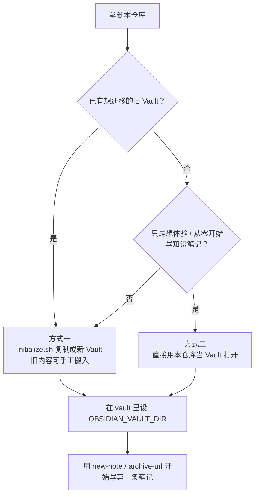
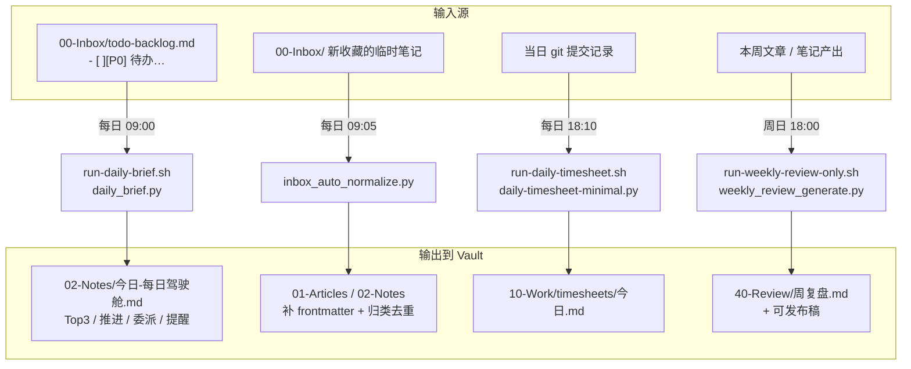
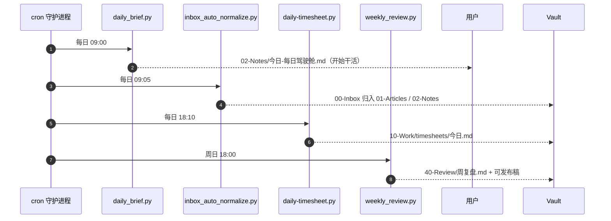
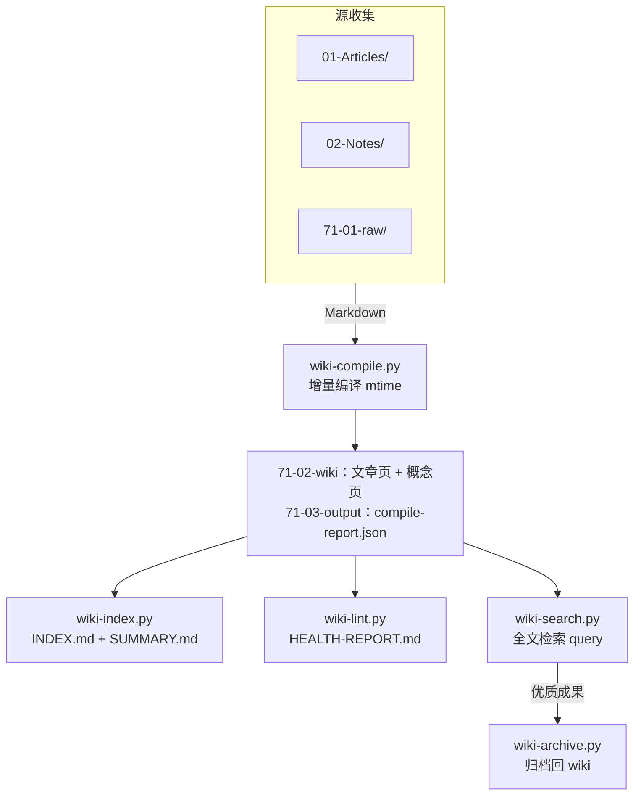

<p align="center">
  
  
  
  
</p>

<h1 align="center">Obsidian AI Vault Scaffold</h1>

<p align="center">一套可复用的 Obsidian <b>AI 知识库 Vault 脚手架</b>：标准分区目录、frontmatter 规范、日常脚本与自动化定时任务。</p>
<p align="center"><a href="./README.md">English</a></p>
<p align="center">仓库本身就是一份可直接用 Obsidian 打开的完整 Vault 骨架 · 脚本立即可用 · 无任何硬编码个人路径</p>

<hr>

## 目录 (Table of Contents)

- [是什么](#-是什么)
- [为什么需要](#-为什么需要)
- [核心概念](#-核心概念)
- [目录结构](#-目录结构)
- [快速开始](#-快速开始)
- [脚本用法速览](#-脚本用法速览)
- [日常操作手册](#-日常操作手册真实用法示例)
- [定时任务](#-定时任务)
- [LLM Wiki（知识库编译）](#-llm-wiki知识库编译)
- [相关项目](#-相关项目)
- [设计原则](#-设计原则)
- [FAQ](#-faq常见问题)
- [路线图](#-路线图)
- [贡献指南](#-贡献指南)
- [许可证](#-许可证)
- [维护者](#-维护者)

## 🎯 是什么

源自个人 Obsidian + LLM 知识库工作区的实战提炼。把「分区 → 规范 → 脚本 → 自动化 → 定时任务」沉淀成一套通用模板：

- **标准分区目录**：`00-Inbox / 01-Articles / 02-Notes / 03-Projects / 04-Memory / 10-Work / 30-Tasks / 40-Review / 60-Life / 70-System / 71-Wiki / 80-Resources / 90-Archive / 91-Bases / 99-Attachments`，各自职责清晰。
- **frontmatter 规范**：所有笔记统一元数据，可检索、可聚类、可做知识图谱。
- **日常脚本**（Python 3.11+，标准库为主）：
  - `new-note.py` —— 一键新建带规范 frontmatter + 骨架的笔记（自动标签）。
  - `add-frontmatter.py` —— 为遗留无 frontmatter 的 md 补全元数据。
  - `html-to-md.py` —— 网页 / HTML → Markdown。
  - `archive-url.sh` / `openclaw-dropin.sh` —— 收藏链接 / 生成笔记。
  - `qmd-noise-guard.sh` —— 巡检索引根目录的噪音文件。
- **定时自动化**（`70-System/70.04-Tools/automations/`）：每日驾驶舱、Inbox 自动规范化、每日工时记录、周复盘、P0/P1→提醒。
- **定时任务模板**（cron / launchd）：见 `70-System/70.05-Configs/templates/`。
- **LLM Wiki 子系统占位**：`71-Wiki` 目录约定完整，编译脚本对接独立的 `llm-wiki-knowledge-vault` 仓库（避免双份维护）。

## 🤔 为什么需要

| 痛点 | 替代方案劣势 | 本脚手架优势 |
| --- | --- | --- |
| Obsidian 笔记越积越乱，无统一规范 | 手工归档、靠习惯，随内容增长很快失控 | 一进来就有 15 个职责清晰的分区 + frontmatter 规范，机器可检索 |
| 每天重复建笔记 / 补元数据 / 记工时 | 模板替换脚本散落各处、无参数化 | 一套标准库优先的脚本，`OBSIDIAN_VAULT_DIR` 参数化，零硬编码 |
| 想全自动跑日常流水线 | 各自手写 cron，无日志、无幂等 | 现成 cron/launchd 模板 + 结构化日志 + 非破坏性自动化 |
| LLM 知识库要编译成 Wiki | 编译逻辑重复维护，双份真相 | `71-Wiki` 薄接口占位，对接独立 `llm-wiki-knowledge-vault`，单一职责 |

**一句话总结**：把"随手丢 → 规范沉淀 → 全自动日常"的闭环做成开箱即用的 Vault 模板，clone 即用。

## 🧠 核心概念

- **分区编号约定**：`两位数空格` 前缀用于排序（00 临时 → 99 附件）；`70-System` 下设 `70.XX-类别` 子层，数字越大越偏向"文档/规范"（70.03 脚本 → 70.07 文档）。`71-Wiki` 独立编号（71.01 原料 → 71.04 脚本），与 70 并列，便于单独管理知识库产品。
- **仓库即 Vault**：clone 打开即用，脚本直接位于规范的运行位置；`OBSIDIAN_VAULT_DIR` 注入所有路径，未设置时回退当前目录。
- **非破坏性自动化**：巡检只报告，不自动删除/移动；`add-frontmatter` 只加不覆盖；`inbox_auto_normalize` 用 `state.json` 保证幂等。

## 🗂 目录结构

```text
.
├── AGENTS.example.md            # 工作区规则模板 → 复制为 AGENTS.md 启用（LLM 行为边界、落盘规范、Python 规范）
├── initialize.sh                # 一键初始化：把本仓库复制为一份独立的新 Vault（干 run，安全）
├── LICENSE                      # MIT 开源协议
├── NOTICE.md                    # 版权/署名声明
├── README.md                    # 英文版总览
├── README.zh-CN.md              # 本文件：中文版总览
│
├── 00-Inbox/                    # 📥 临时收集区：链接、截图、草稿、新搜集材料（就地待整理）
├── 01-Articles/                 # 📄 正式文章/可读文档（日常脚本产出主区；=知识库源①）
│   #   其下再按内容类型分子目录：Knowledge/ Learning/ Article/（new-note 自动归类）
├── 02-Notes/                    # 📝 正式笔记主区（驾驶舱/复盘/学习笔记；=知识库源②）
├── 03-Projects/                 # 💻 代码/脚本/项目资产（可执行资产 + 各自 README）
├── 04-Memory/                   # 🧠 正式长期记忆（主题记忆、偏好、项目长期状态）
├── 10-Work/                     # 🏢 工作资料
│   └── timesheets/              #   每日工时记录（daily-timesheet 脚本输出）
├── 30-Tasks/                    # ✅ 计划与待办（日/周计划、任务清单、技术计划）
├── 40-Review/                   # 🔄 复盘与总结（周/月/年度/项目复盘）
│   #   其下可按周期分子目录：40.01-Weekly/ 40.02-Monthly/ 等
├── 60-Life/                     # 🌿 生活资料（旅行、兴趣等）
│
├── 70-System/                   # ⚙️ 系统层（脚本、自动化、配置、规范 —— 本仓库的核心资产）
│   ├── 70.03-Scripts/
│   │   └── scripts/             # 日常脚本（Python/shell，标准库优先）
│   │       ├── new-note.py           # 一键新建带规范 frontmatter 的笔记（自动标签/归类）
│   │       ├── add-frontmatter.py    # 为存量无 frontmatter 的 md 补全元数据（安全不覆盖）
│   │       ├── html-to-md.py         # 网页/HTML → Markdown
│   │       ├── archive-url.sh        # 把链接收藏为知识笔记（调用 openclaw-dropin）
│   │       ├── openclaw-dropin.sh    # 通用「内容 → 笔记」入口（标题/正文/tag）
│   │       └── qmd-noise-guard.sh    # 巡检索引根目录的噪音文件（非破坏性报告）
│   │
│   ├── 70.04-Tools/
│   │   └── automations/         # 定时自动化（cron/launchd 调用的落点）
│   │       ├── daily_brief.py             # 每日驾驶舱：P0-P3 backlog → Top3/推进/委派
│   │       ├── inbox_auto_normalize.py    # 每日把 Inbox 文件规范化并归类到正式区（state.json 去重）
│   │       ├── daily-timesheet-minimal.py # 每日工时记录 → 10-Work/timesheets
│   │       ├── weekly_review_generate.py  # 周复盘：汇总本周文章/按配置生成
│   │       ├── brain_to_reminders.py      # P0/P1 待办 → 提醒（如推送/通知）
│   │       ├── run-daily-brief.sh         # 每日驾驶舱 wrapper（env 注入 + 日志）
│   │       ├── run-daily-timesheet.sh     # 每日工时 wrapper
│   │       ├── run-weekly-review-only.sh  # 仅周复盘 wrapper
│   │       └── weekly_review_config.json  # 周复盘配置（周期/目录/模板）
│   │
│   ├── 70.05-Configs/
│   │   └── templates/           # 配置模板（initialize.sh 会复制 + 写入实际值）
│   │       ├── vault.env.example    # 环境变量模板（OBSIDIAN_VAULT_DIR / LOG_DIR …）
│   │       ├── cron.template        # crontab 定时任务清单（含 AUTODIR 变量）
│   │       └── launchd.example.plist # macOS 守护进程配置示例（launchctl 用）
│   │
│   ├── 70.06-Workflows/
│   │   └── automation-runtime/   # 自动化运行时（脚本自动创建，通常 .gitignore）
│   │       ├── state.json       #   inbox_auto_normalize 去重状态
│   │       └── logs/            #   各定时任务运行日志（cron-*.log / run-*.json）
│   │
│   └── 70.07-Docs/
│       └── rules/               # 规范（LLM Agent 必读，落地为知识库规则）
│           ├── frontmatter-spec.md   # frontmatter 必填字段、category/tags 建议、自动标签策略
│           └── document-routing.md   # 内容归口与目录路由规则（放哪个分区）
│
├── 71-Wiki/                     # 📚 LLM 知识库编译工作台（占位，对接独立仓库 llm-wiki-knowledge-vault）
│   ├── README.md                #   对接说明
│   ├── 71-01-raw/               #   Wiki 专属原料（剪藏/RSS/导入）
│   ├── 71-02-wiki/              #   编译产出（文章页+概念页，只读，脚本生成）
│   ├── 71-03-output/            #   运行时状态、编译报告、cron 日志
│   └── 71-04-scripts/           #   核心脚本（compile/index/lint/search）
│
├── 80-Resources/                # 🧰 资源与模板区
├── 90-Archive/                  # 🗄 历史归档（不再活跃但保留）
├── 91-Bases/                    # 🗃 数据库/基础数据（结构化查询源）
├── 99-Attachments/              # 📎 附件（PDF/图片/二进制）
│
└── docs/                        # 本仓库的人类可读文档
    ├── README.md                #   docs 索引
    └── guides/
        ├── getting-started.md   #   初始化 + 快速上手
        └── timers.md            #   cron / launchd 定时任务接入
```

**分区编号约定**：`两位数空格` 前缀用于排序（00 临时 → 99 附件）；`70-System` 下设 `70.XX-类别` 子层，数字越大越偏向"文档/规范"（70.03 脚本 → 70.07 文档）。`71-Wiki` 独立编号（71.01 原料 → 71.04 脚本），与 70 并列，便于单独管理知识库产品。

## 🚀 快速开始

要求：`bash 3.2+`、`python3`（3.11+，macOS 用 `/opt/homebrew/bin/python3.13`，**勿用系统损坏的 `/Library/Frameworks/Python` 框架版本**）。

### 方式一：一次初始化成新的独立 Vault

```bash
git clone https://github.com/<you>/obsidian-ai-vault-scaffold.git
cd obsidian-ai-vault-scaffold
./initialize.sh /path/to/your-new-vault
```

### 方式二：直接把这个仓库当 Vault 用

用 Obsidian 打开本仓库即可，然后：

```bash
export OBSIDIAN_VAULT_DIR=/abs/path/to/this/vault
python3 70-System/70.03-Scripts/scripts/new-note.py --kind learning --title "我的第一条笔记"
```

> 所有脚本从环境变量 `OBSIDIAN_VAULT_DIR` 读取 vault 根目录；未设置时回退到当前工作目录。**无任何硬编码个人路径**。

**一次上手，选择哪种方式？**



## ⚡ 脚本用法速览

```bash
# 新建知识/学习/文章/项目笔记（自动生成 frontmatter + 骨架 + 标签）
OBSIDIAN_VAULT_DIR=$PWD python3 70-System/70.03-Scripts/scripts/new-note.py \
  --kind learning --title "Python asyncio" --tags "AI,Python" --source "https://..."

# 为存量 md 补 frontmatter（安全：只加不覆盖）
python3 70-System/70.03-Scripts/scripts/add-frontmatter.py <root_dir> [--dry-run]

# 收藏一个 URL 为知识笔记
70-System/70.03-Scripts/scripts/archive-url.sh "https://example.com/article"

# 每日驾驶舱 / 周复盘（自动化）
OBSIDIAN_VAULT_DIR=$PWD 70-System/70.04-Tools/automations/run-daily-brief.sh
OBSIDIAN_VAULT_DIR=$PWD 70-System/70.04-Tools/automations/run-weekly-review-only.sh
```

详细用法见各脚本 docstring 与 [docs/guides/](docs/guides/)。

## 📖 日常操作手册（真实用法示例）

以下示例基于**个人知识库的日常工作流**，按"一次完整闭环"组织：收藏 → 沉淀 → 驾驶舱 → 复盘。所有命令假设已设 `OBSIDIAN_VAULT_DIR`（`export OBSIDIAN_VAULT_DIR=/path/to/vault`）。

### 场景 1：收藏一篇网页到知识库（随手记 → 正式区）

这是最高频的动作——刷到好文章/网页，一键变成带规范的笔记：

```bash
# 第一步：直接收藏 URL，自动生成 frontmatter + 骨架 + 标签
OBSIDIAN_VAULT_DIR=$PWD 70-System/70.03-Scripts/scripts/archive-url.sh \
  "https://blog.example.com/python-asyncio-best-practices"
# 产出 -> 00-Inbox/YYYY-MM-DD-标题.md（暂存，等每日 Inbox 清洗）

# 若想立即正式入库，用 new-note 指定类型与标签：
OBSIDIAN_VAULT_DIR=$PWD python3 70-System/70.03-Scripts/scripts/new-note.py \
  --kind article --title "Python asyncio 最佳实践" \
  --tags "Python,并发,工程" --source "https://blog.example.com/python-asyncio-best-practices"
# 产出 -> 01-Articles/Article/YYYY-MM-DD-Python-asyncio-最佳实践.md
```

**设计意图**：`00-Inbox` 是唯一"随手丢"的地方，其余分区必须规范命名 + 带 frontmatter。每天由 `inbox_auto_normalize` 统一把 Inbox 清洗、归类、去重（state.json 保证幂等）。

### 场景 2：手动建一篇学习/工作笔记

```bash
# 学习笔记（自动放到 01-Articles/Learning，tag 默认带 Learning/Notes）
python3 70-System/70.03-Scripts/scripts/new-note.py --kind learning --title "RAG 检索增强生成速览" --tags "LLM,RAG" --source "内部培训材料"

# 工作纪要（放 10-Work 相关子目录）
python3 70-System/70.03-Scripts/scripts/new-note.py --kind project --title "会员VIP二期-验车助手-PMO" --category "PMO"
```

### 场景 3：处理存量"脏"文件（无 frontmatter / 命名混乱）

知识库用久了难免有漏网的裸 `.md`。对目录批量补 frontmatter（**安全：只加不覆盖**）：

```bash
# 先看会改哪些（dry-run 不写盘）
python3 70-System/70.03-Scripts/scripts/add-frontmatter.py 00-Inbox --dry-run

# 确认后真正执行
python3 70-System/70.03-Scripts/scripts/add-frontmatter.py 00-Inbox
```

查噪音文件（非破坏性巡检，只报告不删）：

```bash
70-System/70.03-Scripts/scripts/qmd-noise-guard.sh
```

### 场景 4：每日闭环（手动感受全套自动化产出）



```bash
# 手动跑一次"每日驾驶舱"：读 00-Inbox/todo-backlog.md 的 P0–P3，产出今日推进清单
OBSIDIAN_VAULT_DIR=$PWD 70-System/70.04-Tools/automations/run-daily-brief.sh
# 产出 -> 02-Notes/YYYY-MM-DD-每日驾驶舱.md（Top3 / 推进 / 等反馈 / 委派 / 提醒）

# 手动清洗一次 Inbox
OBSIDIAN_VAULT_DIR=$PWD python3 70-System/70.04-Tools/automations/inbox_auto_normalize.py

# 手工记工时（不依赖 git 也能写文件）
OBSIDIAN_VAULT_DIR=$PWD python3 70-System/70.04-Tools/automations/daily-timesheet-minimal.py --date YYYY-MM-DD
# 产出 -> 10-Work/timesheets/timesheet-YYYY-MM-DD.md

# 周末复盘本周产出
OBSIDIAN_VAULT_DIR=$PWD 70-System/70.04-Tools/automations/run-weekly-review-only.sh
# 产出 -> 40-Review/40.01-Weekly/YYYY-MM-DD-周复盘.md（+ 可发布稿到 01-Articles）
```

**如何喂给驾驶舱**：在 `00-Inbox/todo-backlog.md` 里按行写待办，用 `[P0]`/`[P1]`/`[P2]`/`[P3]` 标记优先级（每行 `- [ ] [P0] 今天必须完成的事`）。`daily_brief.py` 会自动读取并按优先级分配"Top3 / 推进 / 委派"。

### 场景 5：网页 HTML 转 Markdown 再入库

```bash
# 网页 -> Markdown（供二次编辑，不直接入库）
python3 70-System/70.03-Scripts/scripts/html-to-md.py \
  --url "https://example.com/long-article" -o /tmp/article.md
# 之后可 new-note 引用 /tmp/article.md 正文，或直接入 71-Wiki/71-01-raw
```

### 每天完整节奏（把操作变成肌肉记忆）

```text
早上 09:00  每日驾驶舱（cron 自动）→ 打开 02-Notes/今日-每日驾驶舱.md
随时     遇到好文/链接 → archive-url / new-note 丢进 00-Inbox
上午 09:05  Inbox 规范化（cron 自动）→ 归入正式区
下班 18:10  工时记录（cron 自动）→ 生成 timesheet
周末 周日 18:00 周复盘（cron 自动）→ 本周产出 + 下周动作
```

可视化时间轴（支持 Mermaid 的环境可渲染）：



## ⏰ 定时任务

自动化脚本挂到系统调度即可全自动跑。现成模板：
- `70-System/70.05-Configs/templates/cron.template`（完整清单，含变量）
- `70-System/70.05-Configs/templates/launchd.example.plist`（macOS 守护进程）
- 接入步骤与 launchd 详解见 **[docs/guides/timers.md](docs/guides/timers.md)**

### 完整 cron 实例（含说明）

把下面的 `<VAULT>` 换成你的 vault 绝对路径，`crontab -e` 粘贴即可。这套时间表对应上文"每天完整节奏"：

```cron
SHELL=/bin/zsh
PATH=/usr/bin:/bin:/usr/sbin:/sbin:/opt/homebrew/bin
PYTHON=${OBSIDIAN_PYTHON:-/opt/homebrew/bin/python3.13}
VAULT=/path/to/your/vault
AUTODIR=${VAULT}/70-System/70.04-Tools/automations
LOGDIR=${VAULT}/70-System/70.06-Workflows/automation-runtime/logs
WIKIDIR=${VAULT}/71-Wiki
WIKILOGDIR=${VAULT}/71-Wiki/71-03-output

# ── 每日任务 ──────────────────────────────
# 09:00  每日驾驶舱：读 todo-backlog 的 P0-P3 → 生成今日推进清单到 02-Notes
0 9 * * * OBSIDIAN_VAULT_DIR="$VAULT" /bin/zsh "$AUTODIR/run-daily-brief.sh" >> "$LOGDIR/cron-daily-brief.log" 2>&1

# 09:05  Inbox 规范化：补 frontmatter、合并归类、去重（state.json 保证幂等）
5 9 * * * OBSIDIAN_VAULT_DIR="$VAULT" "$PYTHON" "$AUTODIR/inbox_auto_normalize.py" >> "$LOGDIR/cron-inbox-normalize.log" 2>&1

# 09:10  把 P0/P1 待办推送到 Apple Reminders（可选，依赖 remindctl）
10 9 * * * OBSIDIAN_VAULT_DIR="$VAULT" "$PYTHON" "$AUTODIR/brain_to_reminders.py" >> "$LOGDIR/cron-brain-to-reminders.log" 2>&1

# 18:10  工时记录：按当日 git 提交生成 timesheet 到 10-Work/timesheets（可选）
10 18 * * * OBSIDIAN_VAULT_DIR="$VAULT" /bin/zsh "$AUTODIR/run-daily-timesheet.sh" >> "$LOGDIR/cron-daily-timesheet.log" 2>&1

# 09:15 / 18:15  LLM Wiki 增量编译（可选，先接入 llm-wiki-knowledge-vault 子系统）
15 9,18 * * * cd "$WIKIDIR" && "$PYTHON" 71-04-scripts/wiki-compile.py >> "$WIKILOGDIR/cron.log" 2>&1

# ── 每周任务 ──────────────────────────────
# 周一 09:20  LLM Wiki 体检/索引一致性检查（可选）
20 9 * * 1 cd "$WIKIDIR" && "$PYTHON" 71-04-scripts/wiki-lint.py >> "$WIKILOGDIR/cron-lint.log" 2>&1

# 周日 18:00  周复盘：本周文章产出汇总 + 下周动作清单
0 18 * * 0 OBSIDIAN_VAULT_DIR="$VAULT" /bin/zsh "$AUTODIR/run-weekly-review-only.sh" >> "$LOGDIR/cron-weekly-review.log" 2>&1
```

### 看日志 & 排障

```bash
# 三条核心日志
tail -f 70-System/70.06-Workflows/automation-runtime/logs/cron-daily-brief.log
tail -f 70-System/70.06-Workflows/automation-runtime/logs/cron-inbox-normalize.log
tail -f 70-System/70.06-Workflows/automation-runtime/logs/cron-weekly-review.log

# 任务不生效怎么办：
#  1) 先在终端手动跑一次对应脚本，看 stderr（脚本幂等，可重复执行）
#  2) 确认 OBSIDIAN_VAULT_DIR 已导出（cron 里已显式传，手动跑要自己 export）
#  3) 确认 PYTHON 指向 python3（≥3.11）；macOS 勿用系统损坏的 /Library/Frameworks 版本
#  4) launchd 需把 OBSIDIAN_VAULT_DIR 写进 StandardOut/StandardErr 或 EnvironmentVariables
```

## 📚 LLM Wiki（知识库编译）

`71-Wiki/` 是 Vault 内的 **LLM 知识库子系统**：把散落在文章/笔记/原料里的 Markdown 源，增量编译成互相链接、可检索、可体检的 Wiki 产物。它是本仓库里最"重"的一块能力，但**设计上刻意保持为薄接口**——详见下方设计取舍。

### 这个仓库里的 71-Wiki 到底有什么

先澄清边界，避免误以为 `71-Wiki/` 是空壳：

```text
71-Wiki/
├── README.md        # 目录约定 + 接入说明（真文件）
├── 71-01-raw/       # Wiki 专属原料：剪藏 / RSS / 外部导入（含 .gitkeep）
├── 71-02-wiki/      # 编译产出：文章页 + 概念页（含 .gitkeep，只读）
├── 71-03-output/    # 运行时状态 + 编译报告 + cron 日志（含 .gitkeep）
└── 71-04-scripts/   # 编译/索引/lint/搜索/归档脚本（含 .gitkeep，占位）
```

本仓库自带：**目录契约**（上表的五段结构）+ **README 接入说明**。不内置任何编译脚本——这是有意为之（见"为什么"）。

### 它是怎么运行的（完整管线）

这套子系统真实跑起来是一段**单向管线**，每挪一步都是一个独立脚本，可单独手动执行、也可由 cron 串起来：



也可用 ASCII 图直读（终端友好）：

```text
源收集                        增量编译                    索引          体检          查询
01-Articles ─┐                                              │              │              │
02-Notes   ──┤ → wiki-compile → 文章页+概念页 → wiki-index → wiki-lint → wiki-search → wiki-archive
71-01-raw  ──┘   (写入 71-02-wiki)   (INDEX/SUMMARY)  (HEALTH-REPORT)  (全文检索)  (归档优质成果)
```

1. **`wiki-compile.py`**（编译）
   - 从三个源目录收集 Markdown：`01-Articles/`、`02-Notes/`、`71-01-raw/`——三路与本仓库的路由规范天然一致（文章/笔记/原料）。
   - **增量模式（默认）**：用 `71-03-output/` 里的增量状态记录每个源文件的 `mtime`，已编译且未变更的直接跳过；只编译新增/修改的文件。
   - 渲染两类产物写进 `71-02-wiki/`：**文章页**（正文规范化 + 概念链接）与**概念页**（按概念聚合、互相链接，自动合并同概念的多处来源）。
   - 每次落一份 `compile-report.json` 到 `71-03-output/`（本次编译了哪些、跳过多少）。
   - `--full` 强制全量重编：先清空产物目录再重建，避免"旧概念页/旧文章页"残留造成断链和噪声。
2. **`wiki-index.py`**（索引）：重生成 `71-02-wiki/INDEX.md`（全部文章 + 一句话摘要）和 `SUMMARY.md`（主题级概览）。通常编译后紧随执行。
3. **`wiki-lint.py`**（体检）：检查断链、依赖、缺失摘要等，产出 `71-02-wiki/HEALTH-REPORT.md`。非破坏性，只报告。
4. **`wiki-search.py`**（检索）：对已编译的 wiki 做朴素全文检索，`wiki-search.py "<关键词>" [--top N] [--json]`。
5. **`wiki-archive.py`**（归档）：把高质量问答/探索成果归档回 wiki，形成闭环。

### 本仓库与编译子系统的分工（Karpathy 设计准则）

这套切分符合三条工程准则，避免最常见的"脚手架里什么都塞"的坑：

- **单一职责，不重复维护**：Wiki 的编译/渲染/检索有独立的测试、发布与版本节奏，若在本仓库再放一份 `wiki-compile.py`，两处就会漂移成两个真相。脚手架只负责**目录契约 + 日常脚本 + 自动化**，编译实现专职在 `llm-wiki-knowledge-vault` 维护。
- **最小改动、外科手术式接入**：接入只做一件事——把 `llm-wiki-knowledge-vault` 的 `71-04-scripts/` 放入本仓库 `71-Wiki/71-04-scripts/`，其余目录结构不动。契约就是那份目录布局，稳定且可验证。
- **可验证的成功标准（而非"让它能跑"）**：管线每步都有可查产物——`compile-report.json`（编译了多少）、`INDEX.md/SUMMARY.md`（索引全不全）、`HEALTH-REPORT.md`（有没有断链）。cron 日志在 `71-03-output/cron*.log`，出问题一眼定位在哪一串。
- **非破坏性**：编译产物区 `71-02-wiki/` 只读、脚本生成、手改会被覆盖；lint 只报告不删除——延续整个脚手架"巡检只报告"的自动化原则。

### 接入 & 定时

把姊妹仓库 `llm-wiki-knowledge-vault` 的脚本复制进来即可，然后 cron 里加两条（完整 cron 见上文"定时任务"节）：

```cron
# 每日 09:15 / 18:15 编译 + 索引
15 9,18 * * * cd "$WIKIDIR" && "$PYTHON" 71-04-scripts/wiki-compile.py && "$PYTHON" 71-04-scripts/wiki-index.py >> 71-03-output/cron.log 2>&1

# 周一 09:20 体检
20 9 * * 1 cd "$WIKIDIR" && "$PYTHON" 71-04-scripts/wiki-lint.py >> 71-03-output/cron-lint.log 2>&1
```

> 注意：cron 里的 `"$WIKIDIR"` 等变量定义见上文"定时任务"节的完整实例。

## 🔗 相关项目

| 仓库 | 定位 |
| --- | --- |
| **obsidian-ai-vault-scaffold** | 本仓库：Vault 脚手架（目录 + 规范 + 脚本 + 自动化 + 定时任务） |
| **llm-wiki-knowledge-vault** | LLM 知识库编译子系统（含公开文章目录） |

## 🧭 设计原则

- **参数化、零硬编码**：所有路径经 `OBSIDIAN_VAULT_DIR` 注入。
- **仓库即 Vault**：clone 打开即用，脚本直接位于规范的运行位置。
- **非破坏性自动化**：巡检只报告，不自动删除/移动。
- **职责单一、避免重复**：Wiki 脚本独立成库，脚手架不重复维护。
- **标准库优先**：第三方依赖（如 html-to-md 的 markdownify/requests）在脚本内注明。

## ❓ FAQ（常见问题）

**Q：我没用过 Obsidian，能用吗？**
A：可以。本仓库是"仓库即 Vault"设计，直接用 Obsidian 打开即可；日常只依赖 `00-Inbox` 丢东西 + `new-note` 建笔记即可上手，无需先懂分区规范。

**Q：`OBSIDIAN_VAULT_DIR` 一定要设吗？**
A：不设也行——脚本回退到当前工作目录。但要跑定时任务（cron/launchd），必须显式导出，因为 cron 环境不继承你 shell 里的变量。

**Q：脚本会不会误删我的笔记？**
A：不会。核心原则是**非破坏性**：`add-frontmatter` 只加不覆盖、`qmd-noise-guard` 只报告不删、`inbox_auto_normalize` 用 `state.json` 保证幂等。动手前都有 `--dry-run` 或日志可查。

**Q：为什么 `71-Wiki` 里没有编译脚本？**
A：有意为之。编译实现专职在独立的 `llm-wiki-knowledge-vault` 仓库维护，脚手架只保留目录契约，避免双份维护与真相漂移。

**Q：macOS 上提示 Python 损坏 / 不能运行？**
A：用 `/opt/homebrew/bin/python3.13`（Homebrew 版本），勿用系统 `/Library/Frameworks/Python` 框架版本；cron 里可用 `PYTHON=${OBSIDIAN_PYTHON:-/opt/homebrew/bin/python3.13}` 统一指定。

## 🗺 路线图 (Roadmap)

- [x] 标准分区目录与 frontmatter 规范
- [x] 日常脚本（new-note / add-frontmatter / html-to-md / archive-url）
- [x] 自动化定时任务（驾驶舱 / Inbox 规范化 / 工时 / 周复盘 / P0/P1 提醒）
- [x] cron / launchd 定时任务模板
- [ ] `71-Wiki` 接入 `llm-wiki-knowledge-vault` 编译子系统的完整示例
- [ ] 一键 `initialize.sh` 全面自动化（含 vault 名 / 作者注入）
- [ ] 更多分区内容路由示例与规则文档

## 🤝 贡献指南 (Contributing)

欢迎贡献！请遵循以下规则：

1. **保持非破坏性**：新增自动化延续"巡检只报告、只加不覆盖"原则。
2. **零硬编码**：路径一律经 `OBSIDIAN_VAULT_DIR` 注入，不得写入个人绝对路径。
3. **标准库优先**：优先用 Python 标准库；第三方依赖需在脚本 docstring 注明。
4. **可验证**：改动请附上验证命令与产物（如 `--dry-run` / 日志样例）。
5. Bug 修复请附回归用例或可复现的验证步骤。

## 📄 许可证

MIT，见 [LICENSE](LICENSE)。

## 👤 维护者 (Maintainer)

本项目由 [Alan Hsu](https://github.com/xsoway) 维护。